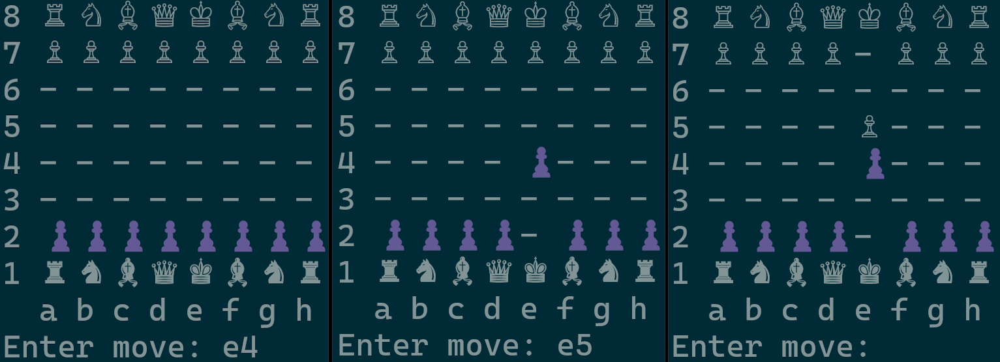

# RustChess

## Information

Terminal-based Chess Clone written in Rust as a learning exercise for the language.
No support for en-passant, castling and promotion yet.
Some stalemate logic missing (only King+Bishop/Knight remaining, stalemate due to repetition, etc.)

## Building

Since this is a Rust project, building and running the project is simply done by invoking *cargo run*.

## Controls

Moves can either be made by:
1. Specifying the desired Piece by its synonym (see Table below; the Pawn specifier is optional - moves without a specifier are intepreted as Pawn moves) and its full Source + Destination Positions: e.g. Nb1:c3, Bc1:h6, c2:c4
2. Specifying the desired Piece by its synonym and the Destination Position: e.g. Nc3, Bh6, c4. If there are multiple pieces that could perform that move (most commonly Knights), one must use option 1 and explicitly specify the Source Position.

| Piece  | Synonym |
|--------|---------|
| Pawn   |   [P]   |
| Rook   |    R    |
| Knight |    N    |
| Bishop |    B    |
| Queen  |    Q    |
| King   |    K    |

### Additional commands

Instead of executing a move, one can perform additional commands:
- [l]ist: Lists the possible moves for each of the current player's active pieces
- [q]uit: Quits the game

## Example

